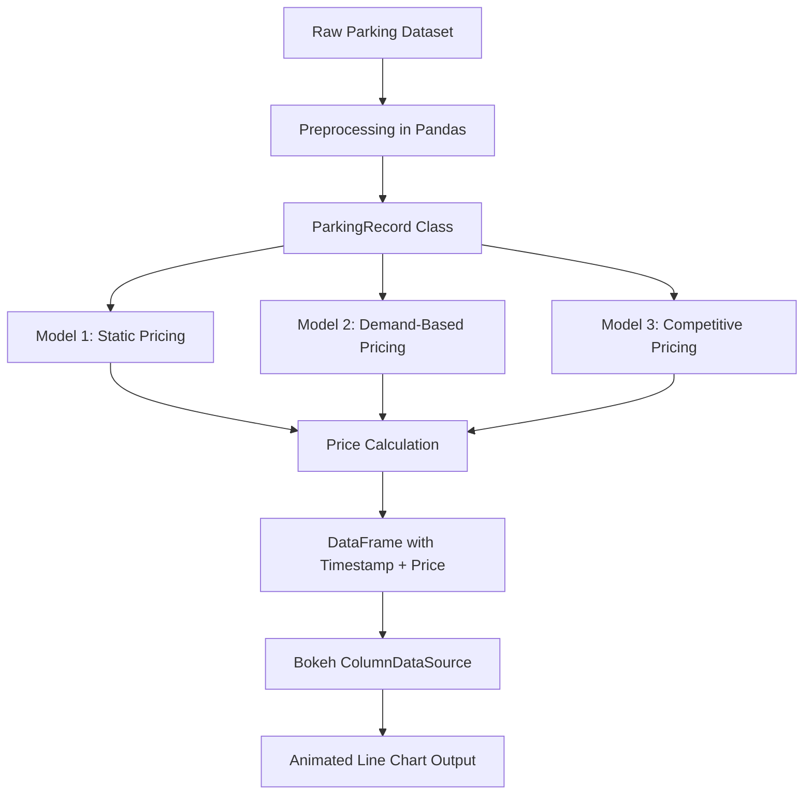

# Capstone-Project-of-Summer-Analytics-2025_Hardik_Mahawar

# Dynamic Pricing for Urban Parking Lots

##  Project Overview
This project addresses the real-world problem of optimizing parking lot pricing using dynamic demand and competition-based models. It simulates a smart urban parking system that adjusts prices in real-time based on occupancy, traffic, queue length, and competitor behavior. The solution was developed as part of the Summer Analytics 2025 Capstone Project.

##  Tech Stack
- **Python**: Core programming language
- **Pandas**: Data manipulation and preprocessing
- **Bokeh**: Real-time plotting and interactive visualization
- **Panel**: Web-friendly dashboard integration (experimental)
- **Google Colab**/**Jupyter Notebook**: Development environment

##  Models Used
### Model 1: Static Pricing (Baseline)
This model sets a constant base price for all lots, irrespective of occupancy, traffic, or competition. It acts as a control for comparing performance of dynamic models.
- Base price: ₹10/hour
- No adjustment for demand or surroundings

### Model 2: Demand-Based Pricing
This model calculates price based on:
- Current occupancy vs. capacity
- Queue length
- Traffic level
- Special event flag
- Vehicle type weight

### Model 3: Competitive Pricing
Builds on Model 2 and adjusts price based on nearby competitors’ prices within a geolocation radius.

##  Demand Function

### Parameter Values
- alpha = 1.0 – occupancy weight
- beta = 0.5 – queue length weight
- gamma = 0.3 – traffic impact
- delta = 1.0 – special day importance
- epsilon = 1.2 – vehicle-type adjustment
- lambda = 0.5 – overall elasticity multiplier

### Assumptions
- Occupancy affects price positively
- Congestion (traffic) lowers desirability, reducing price
- Queue length implies demand surge, increasing price
- Special days increase urgency to park, thus the price
- Larger vehicles imply higher parking value

##  Price Behavior
- **Model 1**: Price remains fixed regardless of external or internal factors
- **Higher demand** ⇒ Price rises (Model 2)
- **Nearby lots with lower price** ⇒ This lot price may reduce (Model 3)
- **Saturation (100% occupancy)** ⇒ Trigger price ceiling or match competitors

##  Architecture Diagram (Mermaid)

## Project Workflow
1. **Data Ingestion**: Load parking dataset (CSV) with timestamps, vehicle type, capacity, occupancy, etc.
2. **Transformation**: Create `ParkingRecord` objects for each row
3. **Modeling**: Apply Models 1, 2, and 3 to compute price
4. **Streaming Output**: Feed price-time data to Bokeh
5. **Batch-Based Visualization**: Show plot every 50 records to simulate animation

## Visualizations
Bokeh line charts show:
- **Price over time** (animated every 50 records)
- Interactive tooltips
- Clear timestamps and scaling

  
## Conclusion
This project demonstrates a real-time, data-driven pricing solution suitable for smart urban mobility systems, using justifiable economic principles, visual feedback, and adaptable components for further deployment.
